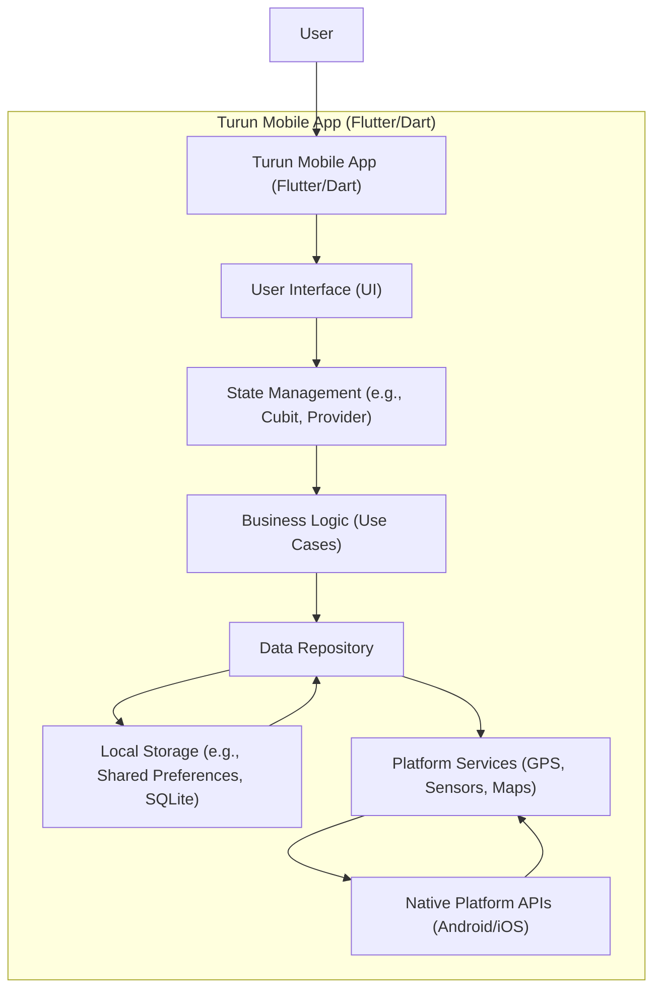

# 🏃‍♂️ Turun - Your Personal Running & Fitness Companion

<p align="center">
  <a href="https://github.com/galihtra/turun">
    
  </a>
  <a href="https://github.com/galihtra/turun">
    
  </a>
  <a href="https://github.com/galihtra">
    
  </a>
  <a href="https://github.com/galihtra/turun/stargazers">
    
  </a>
  <a href="https://github.com/galihtra/turun/issues">
    
  </a>
</p>

Turun is a sleek and intuitive mobile application designed to help you track your running activities, monitor your fitness progress, and achieve your health goals. Whether you're a casual jogger or a seasoned marathoner, Turun provides all the essential tools to log your runs, visualize your routes, and celebrate your achievements in a visually appealing and user-friendly interface.

---


## 🛠️ Tech Stack

Turun is built with a modern and robust technology stack, primarily leveraging Google's Flutter framework for a beautiful, performant, and cross-platform user experience.

-   **Framework**:
    [](https://flutter.dev/)
-   **Language**:
    [](https://dart.dev/)
-   **State Management (Potential)**:
    -   
    -   
    -   
    -   
    _(_The project structure suggests support for various state management patterns, providing flexibility for choosing the optimal approach._)
-   **Asset Handling**:
    -    (for vector icons)
    -    (for engaging animations)
-   **Build Systems**:
    -   [](https://gradle.org/) (for Android)
    -   [](https://developer.apple.com/xcode/) / [](https://cocoapods.org/) (for iOS)
-   **Version Control**:
    [](https://git-scm.com/)

---

## 🚀 Instalasi (Installation)

Follow these steps to get Turun up and running on your local machine for development and testing purposes.

### Prerequisites

Before you begin, ensure you have the following installed:

*   **Flutter SDK**: [Install Flutter](https://flutter.dev/docs/get-started/install)
*   **Git**: [Install Git](https://git-scm.com/downloads)
*   **IDE**: [VS Code](https://code.visualstudio.com/) with Flutter extension or [Android Studio](https://developer.android.com/studio)

### Steps

1.  **Clone the repository:**
    ```bash
    git clone https://github.com/galihtra/turun.git
    cd turun
    ```

2.  **Get Flutter dependencies:**
    ```bash
    flutter pub get
    ```

3.  **Run the application:**

    *   To run on an **Android emulator/device**:
        ```bash
        flutter run
        ```
    *   To run on an **iOS simulator/device**:
        ```bash
        flutter run
        ```
        (Make sure you have Xcode installed and an iOS simulator running or a device connected.)

4.  **(Optional) Generate native app icons (if modified):**
    ```bash
    # If you use a package like flutter_launcher_icons
    flutter pub run flutter_launcher_icons:main
    ```

The app should now be running on your chosen device or simulator!

---

## 📁 Folder Structure

The project follows a standard Flutter project structure, organized for scalability and maintainability.

```
.
├── .vscode/                 # VS Code configurations and code generation templates
├── android/                 # Android specific project files
├── assets/                  # Static assets like images, icons, and Lottie animations
│   ├── icons/
│   ├── images/
│   └── lotties/
├── ios/                     # iOS specific project files
├── lib/                     # Main application source code (where your Dart files reside)
│   ├── api/                 # API service integrations
│   ├── core/                # Core utilities, constants, themes
│   ├── data/                # Data models, repositories, local storage
│   ├── domain/              # Business logic, use cases
│   ├── presentation/        # UI layer (widgets, pages, view models/blocs)
│   └── main.dart            # Application entry point
├── test/                    # Unit and widget tests
├── .env                     # Environment variables
├── .fvmrc                   # Flutter Version Management configuration
├── .gitignore               # Files and directories to ignore in Git
├── analysis_options.yaml    # Dart linter rules
├── pubspec.yaml             # Project dependencies and metadata
└── README.md                # Project README file
```
_Note: The `lib/` and `test/` folders are assumed based on standard Flutter project practices, even if not fully detailed in the provided `ls` output._

---

## 📐 Architecture Diagram

This Mermaid.js diagram illustrates the high-level architecture and data flow within the Turun mobile application.


